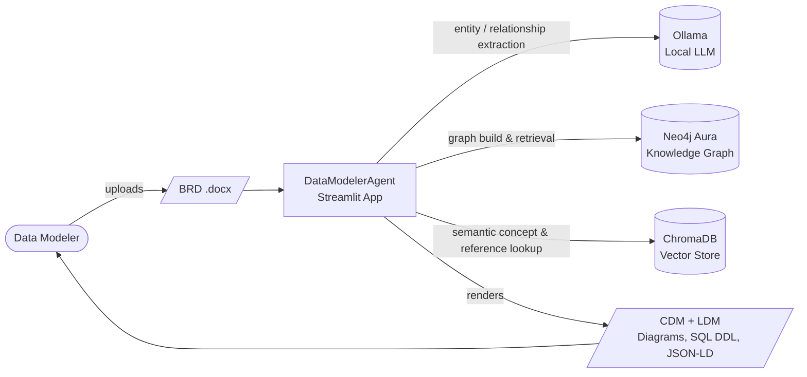
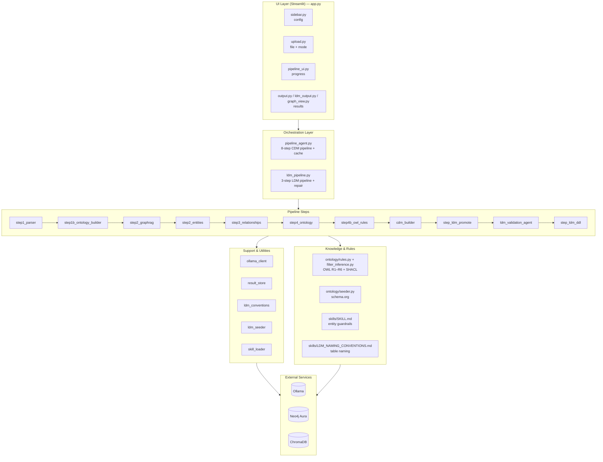
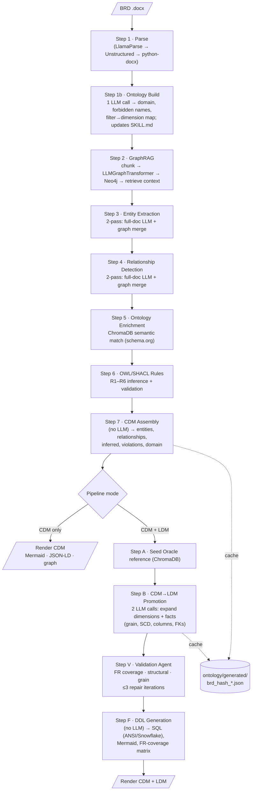

# DataModelerAgent — High-Level Architecture

**DataModelerAgent** is a Streamlit application that turns an unstructured **Business
Requirements Document (BRD, `.docx`)** into a formal **Conceptual Data Model (CDM)** and,
optionally, a **Logical Data Model (LDM)** with SQL DDL. It combines a local LLM (Ollama),
a knowledge graph (Neo4j Aura), a vector store (ChromaDB), and a rule engine (OWL/SHACL) to
extract entities, infer structure, and enforce dimensional-modeling conventions.

---

## 1. System Context

| External service | Role | Configured in |
|---|---|---|
| **Ollama** (`localhost:11434`) | All LLM calls — domain extraction, entity/relationship detection, graph transform, LDM promotion, validation | [config.py](config.py), [agent/ollama_client.py](agent/ollama_client.py) |
| **Neo4j Aura** | Knowledge graph built from BRD chunks; queried for relationship context (GraphRAG) | [config.py](config.py), [agent/step2_graphrag.py](agent/step2_graphrag.py) |
| **ChromaDB** (`./chroma_db`) | Vector store with two collections: `ontology_concepts` (schema.org) and `oracle_retail_reference` | [ontology/seeder.py](ontology/seeder.py), [agent/ldm_seeder.py](agent/ldm_seeder.py) |

---

## 2. Layered Architecture

**Separation of concerns:** the UI never calls external services directly — it invokes the
orchestrators, which sequence the pipeline steps. Steps reach external services only through
the support layer (`ollama_client`, `ldm_seeder`) and apply rules from the knowledge layer.

---

## 3. End-to-End Data Flow

**Caching:** every BRD is hashed (SHA-256, 16 chars). Domain, GraphRAG context, CDM, and LDM
results are persisted to `ontology/generated/` by [agent/result_store.py](agent/result_store.py),
so re-runs are instant and **LDM-only** mode can reuse a prior CDM without re-extraction.

---

## 4. The Two Pipelines

### CDM Pipeline — [agent/pipeline_agent.py](agent/pipeline_agent.py)
`run_pipeline(file, ollama_url, model, chroma_path, ...)` → 8 steps (parse → ontology →
GraphRAG → entities → relationships → ontology enrichment → OWL/SHACL → assemble). Produces a
CDM dict of entities, relationships, inferred entities, SHACL violations, domain metadata, and
graph stats.

### LDM Pipeline — [agent/ldm_pipeline.py](agent/ldm_pipeline.py)
`run_ldm_pipeline(cdm_result, brd_text, ...)` → seed Oracle Retail reference → promote CDM
entities into `DIM_/FACT_/BRIDGE_/REF_` tables (grain, SCD type, surrogate/natural keys,
metric additivity) → validate-and-repair. DDL/diagram generation is rule-based in
[agent/step_ldm_ddl.py](agent/step_ldm_ddl.py).

---

## 5. Key Design Patterns

- **Tiered parser fallback** — best-quality parser first, always degrades to `python-docx`.
- **Two-pass extraction** — holistic full-document LLM read, then merge graph-discovered facts.
- **Hybrid rules + LLM** — deterministic OWL/SHACL rules (R1–R6, naming/pattern checks) guard
  creative LLM output; the validation agent combines both with a bounded repair loop.
- **RAG grounding** — ChromaDB supplies schema.org concepts (CDM) and Oracle Retail standards
  (LDM) so generated models follow established conventions.
- **Single source of truth for conventions** — [skills/SKILL.md](skills/SKILL.md) governs
  entity extraction; [skills/LDM_NAMING_CONVENTIONS.md](skills/LDM_NAMING_CONVENTIONS.md)
  governs table/column naming. Both are injected into prompts.
- **Hash-based caching & persistence** — results survive Streamlit reruns and session restarts.

---

## 6. Outputs

| Artifact | Produced by |
|---|---|
| CDM entity/relationship tables + interactive graph | [ui/output.py](ui/output.py), [ui/graph_view.py](ui/graph_view.py) |
| CDM Mermaid ER diagram & JSON-LD (RDF) | [agent/cdm_builder.py](agent/cdm_builder.py) |
| Inferred entities + SHACL violations | [ontology/rules.py](ontology/rules.py) |
| LDM table definitions (grain, SCD, columns) | [agent/step_ldm_promote.py](agent/step_ldm_promote.py) |
| SQL DDL (ANSI + Snowflake), LDM diagram, FR-coverage matrix | [agent/step_ldm_ddl.py](agent/step_ldm_ddl.py), [ui/ldm_output.py](ui/ldm_output.py) |
